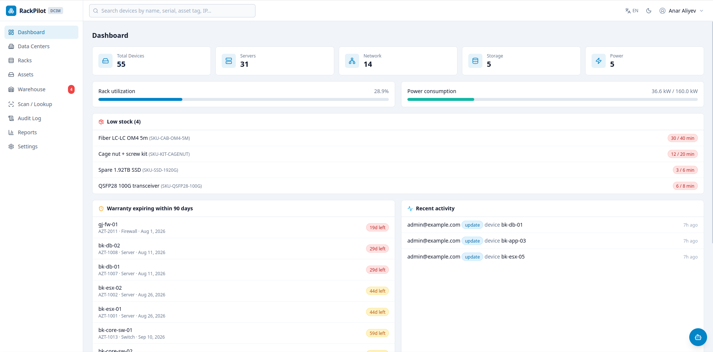
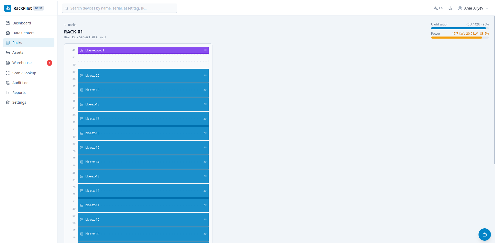
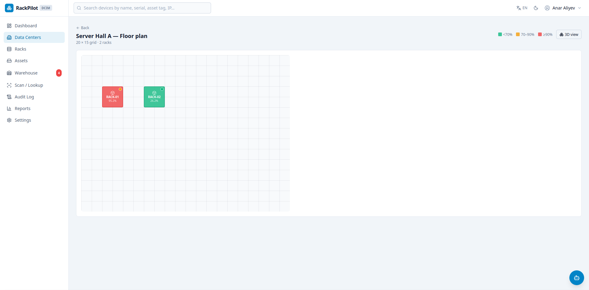
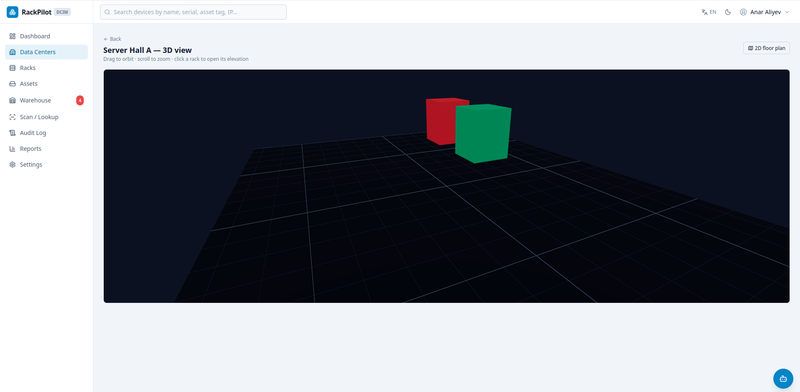
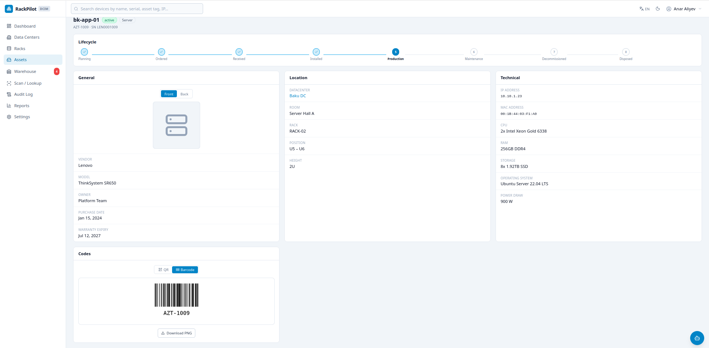
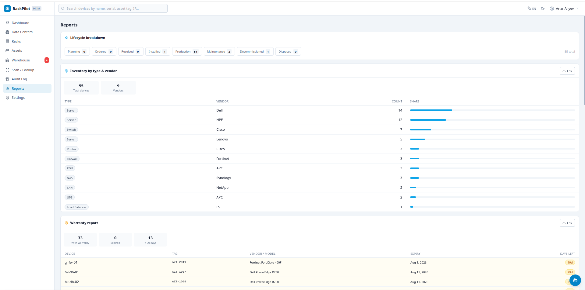

# RackPilot DCIM

Multi-tenant Data Center Infrastructure Management — track datacenters, rooms, racks and devices with an interactive rack elevation, a 2D floor plan, a 3D room view, full audit trail, and import/export.


RackPilot is a portfolio project that reproduces the day-to-day workflows of a
real Data Center Infrastructure Management (DCIM) tool: knowing what hardware you
own, where each unit is racked, how full your racks are, what is under warranty,
and who changed what.

---

## Screenshots

| Dashboard | Rack elevation | Floor plan |
| --- | --- | --- |
|  |  |  |

| 3D room view | Asset inventory | Reports|
| --- | --- | --- |
|  |  |  |

> Screenshots are placeholders in `docs/screenshots/` — capture the running app to
> populate them. Worth capturing: the dashboard, a nearly-full rack elevation with a
> device photo thumbnail, the 2D floor plan, the 3D room view, the asset table, and an
> expanded audit diff.

---

## Features

### Multi-tenant & RBAC
- Every organization is fully isolated; all queries are scoped by `organization_id`
  through a single shared dependency, never ad hoc in endpoints.
- Three roles: **admin** (full access + org/user management), **engineer**
  (full CRUD on infrastructure), **viewer** (read-only). The UI hides every
  mutating control from viewers, and the API enforces it independently.

### Infrastructure hierarchy
- Organization → Data Center → Room → Rack (42U default) → Device, each modelled
  as a first-class resource with its own CRUD.

### Interactive rack elevation
- Vertical U-by-U elevation rendered from a live layout endpoint.
- Devices are colored blocks spanning their real height, draggable to move,
  with a non-drag position picker fallback that only offers free slots.
- Placement respects height and overlap — the backend enforces conflicts with
  clear 409 responses that the UI surfaces.

### 2D floor plan & 3D view
- Per-room floor plan: racks as rectangles at stored grid positions, colored by
  utilization, draggable to reposition (snapped to grid, persisted on drop).
- 3D room view (three.js / react-three-fiber): racks as boxes sized by U-height,
  orbit/pan/zoom, click a rack to open its elevation. Falls back gracefully when
  WebGL is unavailable.

### Asset inventory
- Server-side search (name / serial / asset tag / IP), filters (type, status,
  lifecycle, datacenter), pagination, and a full device detail view.
- Optional front and back device photos with server-side validation and resizing.

### Asset lifecycle
- Eight-stage lifecycle (planning → ordered → received → installed → production →
  maintenance → decommissioned → disposed) tracked separately from operational
  status, with a stepper on the device page and a forward-progression guard
  (reversing out of a terminal stage needs an admin).
- Purchase date, support contract, and department fields; lifecycle breakdown on
  the reports page and a lifecycle filter on the asset table.

### Power management
- Per-device power draw and per-rack power capacity (default 10kW). Rack views
  show a capacity bar with a normal / warning / critical status (70% / 90%
  thresholds); floor-plan tiles and rack cards carry a power indicator.
- Dashboard and reports roll power consumption up per datacenter.

### AI assistant (optional)
- Floating chat widget that answers natural-language questions about the org's
  infrastructure, backed by OpenRouter. Strictly tenant-scoped context; disabled
  gracefully when no API key is set (see below).

### QR codes & barcodes
- Every device and stock item generates a QR code (links to its detail page) and
  a Code128 barcode (encodes the asset tag / SKU), downloadable as PNG.
- A Scan / Lookup page resolves a scanned asset tag or SKU to the right entity —
  auto-focused and auto-submitting so a USB barcode scanner works hands-free.
- Bulk "Print labels" lays out QR / barcode / both for a selection of devices on
  a printable label sheet.

### Warehouse & stock
- Warehouses as their own top-level locations, holding stock items tracked by
  quantity (category, unit, low-stock threshold) plus a full stock-movement
  ledger (received / issued / adjusted / returned) that keeps the running
  quantity and can't go negative.
- A serialized device lives in at most one place — a rack or a warehouse — and
  the device form's Location toggle switches between them.
- Low-stock alerts on the dashboard and a sidebar badge; a stock-levels report.

### Import / Export
- Export the org's devices to CSV or XLSX honoring the active filters.
- Import from CSV/XLSX with per-row validation (required fields, enum values,
  per-org uniqueness, rack-by-name placement with overlap checks); the response
  reports imported/failed counts and a downloadable error list.

### Audit trail
- Every create/update/delete writes an audit row with old/new JSON snapshots.
- The audit page filters by action, entity, user and date range, and expands
  each entry into a side-by-side diff of only the changed fields.

### Dashboard & Reports
- Dashboard: device counts by group, overall rack utilization, warranty alerts
  (next 90 days), and a recent-activity feed.
- Reports: inventory by type & vendor, warranty report (expired / <90 days
  highlighted), and capacity per rack with a per-datacenter rollup — each
  exportable to CSV.

---

## Architecture

```
                    ┌─────────────────────────────┐
   Browser  ─────▶  │  nginx  (serves SPA + /api)  │
                    └───────────────┬─────────────┘
                        static      │  proxy /api
                    ┌───────────────┴─────────────┐
   React SPA  ◀─────│      FastAPI (backend)       │
   (Vite/TS)        │  routers → services → models │
                    └───────────────┬─────────────┘
                                    │  SQLAlchemy 2.0 / Alembic
                            ┌───────┴────────┐
                            │  PostgreSQL 16 │
                            └────────────────┘
```

**Layered backend.** Routers (`app/api`) contain no business logic — they call
services (`app/services`), which own all rules and the audit writes; models
(`app/models`) and Pydantic schemas (`app/schemas`) stay thin. Cross-cutting
concerns (config, DB session, JWT/security, shared dependencies) live in
`app/core`.

**Multi-tenancy.** Authentication resolves the current user, and a single
`get_current_org_id` dependency yields the tenant. Every service query filters by
it, so a user in org A can never read or mutate org B's data — enforced in one
place rather than repeated per endpoint.

**Audit design.** Mutating service methods serialize the entity before and after
the change and append an `AuditLog` row (user, action, entity, old/new JSON,
timestamp) in the same transaction as the change, so the trail can never drift
from the data.

---

## Tech stack

| Layer | Technology |
| --- | --- |
| Frontend | React 18, TypeScript, Vite, Tailwind CSS, React Router, Axios, lucide-react, three.js / react-three-fiber |
| Backend | FastAPI, Pydantic v2, SQLAlchemy 2.0, Alembic, PyJWT, passlib/bcrypt, openpyxl, Pillow |
| Database | PostgreSQL 16 |
| Infra | Docker Compose (dev + prod), nginx, gunicorn/uvicorn workers |
| CI | GitHub Actions (pytest against a Postgres service, tsc + build) |

---

## Quick start

```bash
git clone https://github.com/AgilGuliyev1337/rackpilot-dcim.git
cd rackpilot-dcim
cp .env.example .env

# Start the development stack (Postgres + backend + frontend)
docker compose up -d --build

# Apply migrations and load demo data
docker compose exec backend alembic upgrade head
docker compose exec backend python seed.py
```

Then open:

- App: <http://localhost:3000>
- API docs (Swagger): <http://localhost:8000/docs>

**Demo credentials** (password `Demo123!` for all):

| Email | Role |
| --- | --- |
| admin@example.com | admin |
| engineer@example.com | engineer |
| viewer@example.com | viewer |

`make help` lists shortcuts (`make dev`, `make prod`, `make seed`, `make test`, `make backup`).

### Production

```bash
cp .env.production.example .env.production   # fill in real secrets
make prod                                    # nginx entry on $APP_PORT (default 8080)
```

---

## Running tests

```bash
cd backend
pytest              # requires a Postgres reachable via TEST_DATABASE_URL
```

The suite covers auth, tenant isolation, rack-position conflicts, role
enforcement, and device import/export. The frontend is type-checked and built in
CI (`npx tsc --noEmit` + `npm run build`).

---

## API overview

| Group | Endpoints |
| --- | --- |
| Auth | `POST /api/auth/register` · `POST /api/auth/login` · `POST /api/auth/refresh` · `GET /api/auth/me` |
| Infrastructure | `/api/datacenters` · `/api/rooms` · `/api/racks` (+ `/racks/{id}/layout`) |
| Devices | `/api/devices` (search/filter/paginate) · `/api/devices/{id}/photo` |
| Import/Export | `/api/devices/export` · `/api/devices/import` · `/api/devices/import/template` |
| Insight | `/api/dashboard` · `/api/reports` · `/api/audit-logs` |

Full interactive reference at `/docs` when the backend is running.

---

## Project structure

```
rackpilot-dcim/
├── backend/
│   ├── app/
│   │   ├── api/          # routers (thin)
│   │   ├── core/         # config, db, security, shared deps
│   │   ├── models/       # SQLAlchemy models
│   │   ├── schemas/      # Pydantic request/response models
│   │   └── services/     # business logic + audit writes
│   ├── alembic/          # migrations
│   ├── tests/            # pytest suite
│   └── seed.py           # idempotent demo data
├── frontend/
│   └── src/
│       ├── api/          # typed API client
│       ├── components/   # UI kit + layout
│       ├── context/      # auth, theme, toast
│       ├── pages/        # routed views
│       └── types/        # TS interfaces mirroring the API
├── docs/                 # architecture notes, screenshots, build log
├── docker-compose.yml        # dev
└── docker-compose.prod.yml   # production (nginx + gunicorn)
```

---

## AI assistant (optional)

RackPilot ships with an optional chat assistant (bottom-right widget) that answers
natural-language questions about your infrastructure — e.g. "which racks have
available space?", "which racks are overloaded on power?", "how many devices need
warranty renewal soon?". It gathers a compact, strictly tenant-scoped snapshot of
your organization and sends it, with the question, to an LLM via
[OpenRouter](https://openrouter.ai) (one API for OpenAI, Anthropic, and other
models).

The feature is fully optional and off by default. To enable it:

1. Sign up at [openrouter.ai](https://openrouter.ai) and generate an API key.
2. Set it in your `.env` (or `.env.production`):
   ```
   OPENROUTER_API_KEY=sk-or-...
   OPENROUTER_MODEL=openai/gpt-4o-mini   # optional; any OpenRouter model slug
   ```
3. Restart the backend.

Without a key the widget still appears but reports that it is not configured — the
rest of the app is unaffected. The model is configurable so you can swap providers
without a code change.

## Roadmap

Honest future direction, roughly in priority order:

- AD / LDAP authentication integration
- VMware vCenter linkage (map VMs to physical hosts)
- Network & cabling topology diagrams
- Per-rack power (kW) capacity planning
- QR-code asset lookup
- Email notifications (warranty expiry, capacity thresholds)
- Multi-language UI — English and Azerbaijani ship today (switchable in the top
  bar / Settings); Turkish and fuller page coverage planned
- Prometheus / Grafana metrics export
- SNMP / IPMI discovery for auto-inventory
- Kubernetes deployment manifests

---

## Author

**Agil Guliyev** — Linux System Administrator & Infrastructure Engineer.

RackPilot DCIM is inspired by real-world DCIM workflows — NetBox for
source-of-truth inventory and vCenter operations at a telecom operator — rebuilt
from scratch to demonstrate full-stack design, multi-tenancy, and production
packaging.

- GitHub: <https://github.com/AgilGuliyev1337>
- LinkedIn: <https://www.linkedin.com/in/agil-guliyev-5b0a86255/>

## License

MIT — see [LICENSE](LICENSE).
